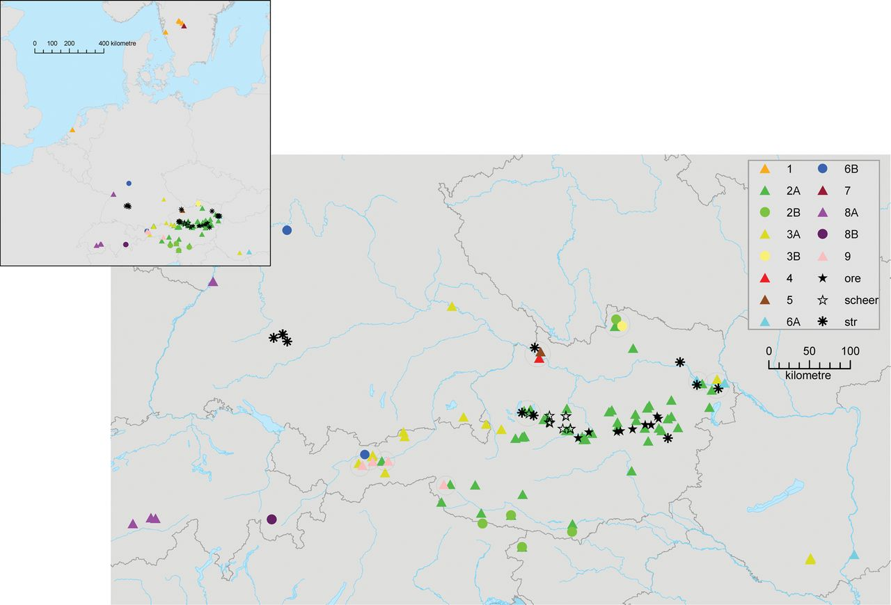

# _Trochulus_ Population genetics based on ddRAD sequencing data

In this project, we investigate  genetic diverstity and differentiation in closely related land snails of the genus _Trochulus_. Despite occuring in sym- and parapatry, these snails are divided into highly distinct mitochondrial clades. It is not yet known, if similar patterns are also found in the nuclear genome.

We therefore generated ddRAD sequencing data based on double-digestion of genomic DNA of **XX** individual samples (of **XX** species and subspecies) with enzymes **XX** and **YY**. Paired-end libraries (kit **XX**) were multiplexed and sequenced on a Illumina **XX** machine by company **XX**.

## (1) Datasets

We obtained demultiplexed raw reads from **XX** and first quantitatively tested paramter combinations of the [Stacks](https://catchenlab.life.illinois.edu/stacks/manual/#pipe) pipeline. To this end we generated three subset, each consisting on twelve samples as described below:

-   [x] **(A) Full range**: 12 samples that range across the whole dataset, i.e. including all outgroups.

-   [x] **(B) Without outgroup**: 12 samples, excluding all outgroups.
-   [x] **(B) Ingroup only**: 12 samples comprised of the most closely related _T. xxx_ individuals only

## (2) Parameters

We based our analysis on the commonly software Stacks, which allow to identify SNP variation Three major paramaters are deemed to have the greatest impact on ddRAD analyses. Their influence is depcited in the below figure

-   **-m**: Minimum stack depth / minimum depth of coverage. The minimum stack depth parameter controls the number of raw reads required to form an initial stack. If the depth of coverage for a particular stack is below this value, then an allele will not be formed

-   **-M**: Distance allowed between stacks. This represents the number of nucleotides that may be different between two stacks in order to merge them. These nucleotide differences may be due to polymorphisms present between two alleles, or they may be due to sequencing error.
